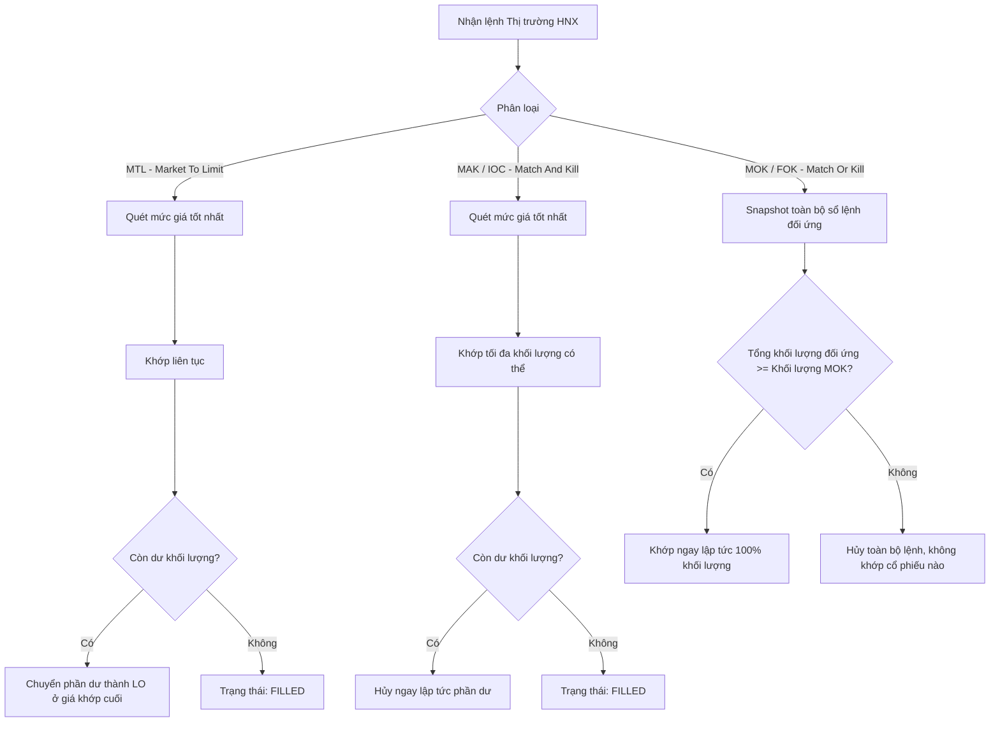
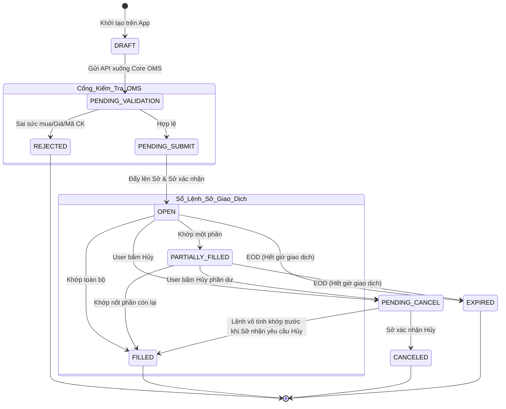
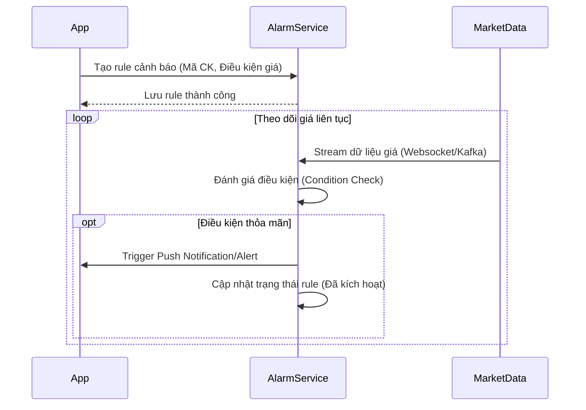
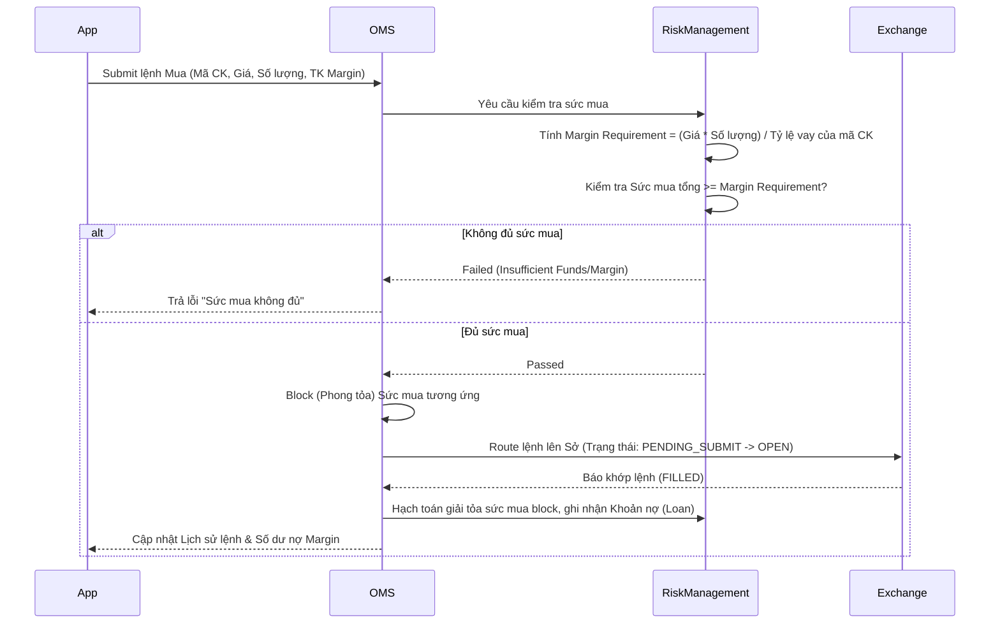
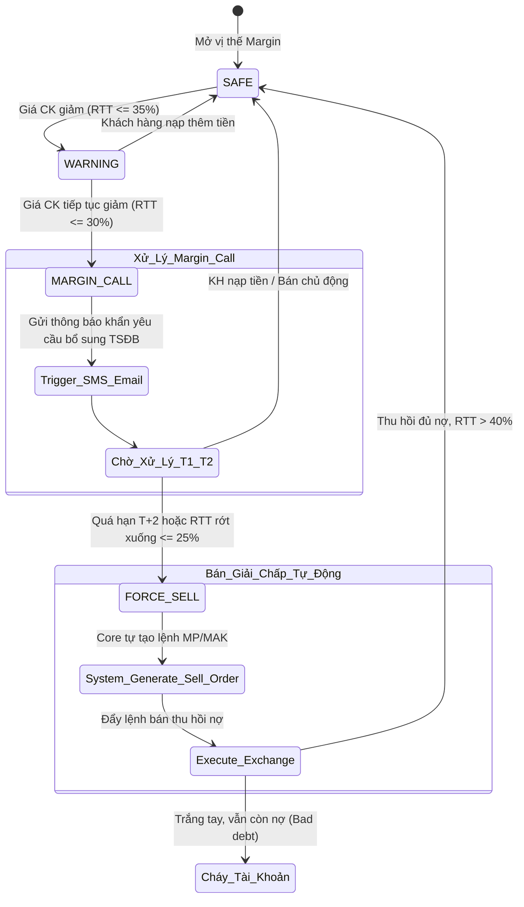
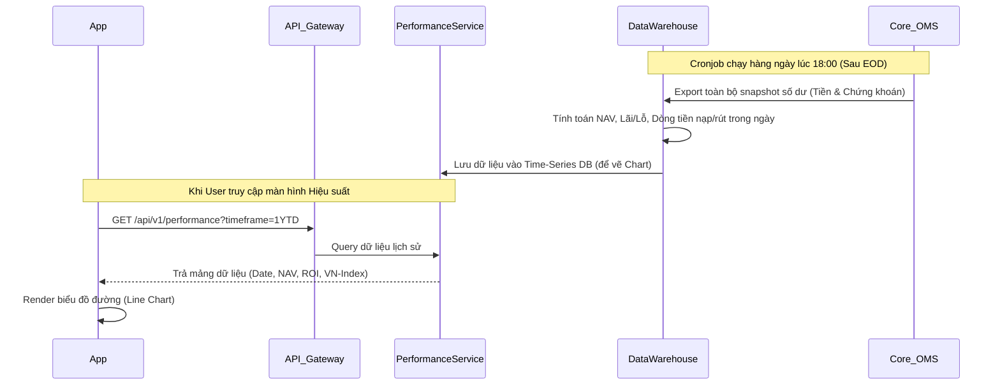
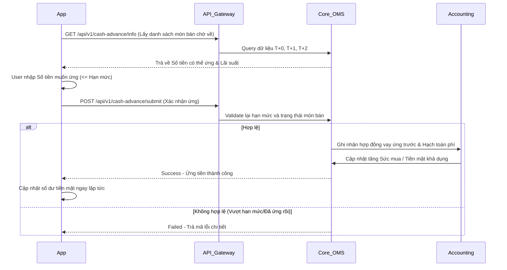
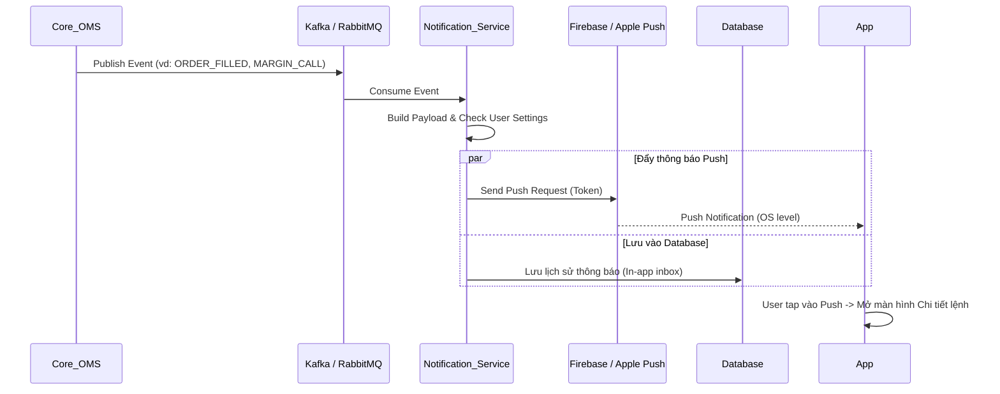

# Tài Liệu Đặc Tả: Quy Định và Luồng Xử Lý Hệ Thống Giao Dịch Chứng Khoán
> Tài liệu này được tổng hợp và cấu trúc chuẩn hóa, phục vụ trực tiếp cho việc lập tài liệu đặc tả yêu cầu phần mềm (SRS), thiết kế kiến trúc hệ thống (System Design) và xây dựng kịch bản kiểm thử (Test Cases) cho các ứng dụng giao dịch tài chính.

---

## 1. So Sánh Tổng Quan: Chứng Khoán Cơ Sở vs Phái Sinh

| Tiêu chí | Chứng khoán Cơ sở | Chứng khoán Phái sinh (HĐTL VN30) |
|---|---|---|
| **Sản phẩm chính** | Cổ phiếu, Trái phiếu, Chứng chỉ quỹ, ETF. | Hợp đồng tương lai, Chứng quyền có bảo đảm (CW). |
| **Chu kỳ thanh toán**| T+2.5 (Mua xong 2.5 ngày sau cổ phiếu mới về). | T+0 (Mở và đóng vị thế liên tục trong ngày). |
| **Chiều sinh lời** | 1 chiều (Long - Lãi khi giá tăng). | 2 chiều (Long/Short - Lãi khi giá tăng/giảm). |
| **Ký quỹ (Margin)** | Tối đa 50% (Tỷ lệ 1:1), cấp bởi CTCK. | ~13% - 17% giá trị hợp đồng, quy định bởi VSD. |
| **Đáo hạn** | Không có (Nắm giữ vô thời hạn). | Định kỳ hàng tháng (Thứ 5 tuần thứ 3 của tháng). |
| **Mục đích chính** | Đầu tư giá trị, hưởng cổ tức, chênh lệch giá. | Đầu cơ ngắn hạn (Trading), Phòng vệ rủi ro (Hedging). |

---

## 2. Nguyên Tắc Khớp Lệnh Cốt Lõi (Matching Engine Rules)

Cỗ máy khớp lệnh (Matching Engine) của Sở Giao dịch luôn tuân thủ 2 nguyên tắc ưu tiên sau, áp dụng cho mọi loại lệnh:

1. **Ưu tiên về giá (Price Priority):**
   - **Lệnh Mua:** Giá **cao hơn** xếp trước trong Order Book.
   - **Lệnh Bán:** Giá **thấp hơn** xếp trước trong Order Book.
2. **Ưu tiên về thời gian (Time Priority):**
   - Nếu nhiều lệnh cùng mức giá, lệnh nào vào hệ thống sớm hơn (Timestamp nhỏ hơn) sẽ được khớp trước.

---

## 3. Đặc Tả Các Loại Lệnh Giao Dịch & Thời Gian Áp Dụng

### 3.1. Lệnh Giới Hạn (LO - Limit Order)
- **Logic:** Người dùng thiết lập một mức giá trần (khi mua) hoặc giá sàn (khi bán). Lệnh chỉ khớp ở mức giá này hoặc tốt hơn.
- **Trạng thái:** Tồn tại cho đến khi khớp hết, bị hủy, hoặc hết ngày giao dịch.
- **Thời gian đặt lệnh theo sàn:**
  - **HOSE:** 09:00 - 11:30 & 13:00 - 14:45 (Áp dụng trong cả phiên định kỳ và phiên liên tục).
  - **HNX:** 09:00 - 11:30 & 13:00 - 14:45 (Áp dụng trong cả phiên định kỳ và phiên liên tục).
  - **UPCoM:** 09:00 - 11:30 & 13:00 - 15:00 (Sàn UPCoM chỉ có phiên khớp lệnh liên tục).

### 3.2. Lệnh Định Kỳ (ATO/ATC)
- **Logic:** Áp dụng trong 15 phút mở/đóng cửa để xác định giá tham chiếu/chốt phiên. Hệ thống gom tất cả lệnh để tính toán ra **một mức giá duy nhất** có khối lượng khớp lớn nhất.
- **Độ ưu tiên:** Ưu tiên khớp trước mọi lệnh LO tại phiên định kỳ. Phần dư bị hủy ngay khi hết 15 phút.
- **Thời gian đặt lệnh theo sàn:**
  - **Lệnh ATO (Mở cửa):** Chỉ áp dụng trên sàn **HOSE** (Thời gian: 09:00 - 09:15).
  - **Lệnh ATC (Đóng cửa):** Áp dụng trên **HOSE** và **HNX** (Thời gian: 14:30 - 14:45). 
  *(Lưu ý: Sàn UPCoM không áp dụng lệnh ATO và ATC, do đó không thể đặt loại lệnh này trên UPCoM).*

### 3.3. Lệnh Thị Trường Trên HOSE (MP)
- **Logic:** Chấp nhận mua/bán bằng mọi giá. Quét sổ lệnh đối ứng từ giá tốt nhất đến khi đủ khối lượng. Nếu hết đối ứng mà lệnh MP còn dư, phần dư tự động chuyển thành lệnh **LO** tại mức giá giao dịch gần nhất.
- **Thời gian đặt lệnh theo sàn:**
  - **HOSE:** 09:15 - 11:30 & 13:00 - 14:30 (Lệnh MP chỉ được phép nhập vào hệ thống trong phiên **Khớp lệnh liên tục**, không được sử dụng trong phiên ATO/ATC).

---

## 4. Phân Tích Chuyên Sâu Lệnh Thị Trường HNX (MTL, MAK, MOK)

Dưới góc độ hệ thống, HNX phân rã lệnh thị trường thành 3 loại để kiểm soát rủi ro trượt giá và khối lượng treo.


**Lưu ý thiết kế:** Lệnh MOK (FOK) đòi hỏi tính toàn vẹn giao dịch (ACID) cực cao. Trong quá trình test performance, cần chú ý kịch bản race-condition khi có nhiều lệnh cùng tranh giành khối lượng đối ứng.

---

## 5. Vòng Đời Lệnh & Sơ Đồ Trạng Thái (Order State Machine)

Quá trình chuyển đổi trạng thái lệnh giữa Front-end App, Quản lý Lệnh (Core OMS) và Sở Giao dịch (Exchange).



## 6. Luồng Xử Lý Hệ Thống Chi Tiết (Workflow Lifecycle)

1. **Khởi tạo và Kiểm định (Origination & Validation):** Khi người dùng đặt lệnh, hệ thống thực hiện Block (phong tỏa) tiền mặt hoặc chứng khoán tương ứng để tránh double-spending. Trạng thái: `PENDING_VALIDATION`.
2. **Định tuyến (Routing & Queueing):** Core OMS đẩy bản tin FIX xuống Sở Giao Dịch. Sở cấp một OrderID duy nhất và ghi vào sổ lệnh. Trạng thái: `OPEN`.
3. **Thực thi (Execution):** Sở phát sinh bản tin Execution Report gửi về OMS mỗi khi có giao dịch. OMS ghi nhận và cập nhật trạng thái (`PARTIALLY_FILLED` hoặc `FILLED`).
4. **Đóng lệnh (Termination) và Post-Trade:** Lệnh đạt Terminal States (`FILLED`, `CANCELED`, `REJECTED`, `EXPIRED`). OMS tiến hành giải tỏa tiền/cổ phiếu block dư, tính phí, thuế và chuẩn bị hạch toán hằng ngày.


---

## 7. Danh Sách Tính Năng Cốt Lõi (Core Features) & Luồng Nghiệp Vụ (Workflows)

Dưới đây là mô tả tổng quát và luồng xử lý cho các tính năng nền tảng trong một ứng dụng chứng khoán, hỗ trợ trực tiếp cho quá trình viết Use Case và thiết kế Sequence Diagram trong tài liệu SRS.

### 7.1. Tính Năng Quản Lý Đặt Lệnh (Order Management)
- **Mô tả tổng quát:** Hệ thống cho phép người dùng đặt, sửa, hủy các lệnh mua/bán chứng khoán. Nó đóng vai trò như một màng lọc, tính toán và kiểm tra các giới hạn rủi ro (Risk Management) như sức mua, tỷ lệ ký quỹ trước khi định tuyến lệnh đi.
- **Workflow cơ bản:**
  1. Người dùng nhập thông tin lệnh (Mã CK, Số lượng, Giá, Loại lệnh).
  2. Hệ thống (OMS) kiểm tra tính hợp lệ (Sức mua, Margin, Tồn quỹ, Bước giá).
  3. Block (phong tỏa) tiền hoặc chứng khoán tương ứng để tránh double-spending.
  4. Định tuyến lệnh lên cỗ máy khớp lệnh (Matching Engine) của Sở.
  5. Xử lý bản tin trả về (Execution Report), cập nhật trạng thái lệnh và hạch toán giải tỏa tài sản.

### 7.2. Tính Năng Cảnh Báo Giá Theo Thời Gian Thực (Real-time Price Alarm)
- **Mô tả tổng quát:** Cho phép người dùng thiết lập các ngưỡng giá mục tiêu (Target price) hoặc cắt lỗ (Stop-loss). Khi điều kiện giá thị trường thỏa mãn, hệ thống sẽ trigger và đẩy thông báo (Push Notification/SMS) ngay lập tức. Tính năng này đòi hỏi xử lý stream dữ liệu độ trễ thấp.
- **Workflow cơ bản:**


### 7.3. Tính Năng Quản Lý Danh Mục Đầu Tư (Portfolio Management)
- **Mô tả tổng quát:** Cung cấp bức tranh toàn cảnh về tài sản của nhà đầu tư, bao gồm cổ phiếu, phái sinh, chứng chỉ quỹ và tiền mặt. Tính năng này thực hiện Mark-to-market (định giá theo thị trường) để hiển thị lãi/lỗ chưa thực hiện (Unrealized P&L) theo thời gian thực.
- **Workflow cơ bản:**
  1. Người dùng truy cập màn hình Danh mục.
  2. App gọi API lấy dữ liệu sổ cái (Ledger) về số lượng tài sản nắm giữ và giá vốn.
  3. App subscribe kênh Market Data để lấy giá khớp lệnh gần nhất (Current Price).
  4. Thuật toán frontend/backend tính toán: `Tỷ lệ Lãi/Lỗ = ((Giá hiện tại - Giá vốn) * Số lượng) - Phí/Thuế dự tính`.
  5. Giao diện render đồ thị cơ cấu tài sản và P&L liên tục theo từng nhịp đập của thị trường.


---

## 8. Đặc Tả Chi Tiết: Quản Lý Lệnh & Danh Mục Đầu Tư (Tích hợp Margin)

Giao dịch ký quỹ (Margin) là đòn bẩy tài chính cốt lõi nhưng cũng mang lại rủi ro hệ thống cao nhất. Việc thiết kế phân hệ Quản lý lệnh (Order Management) và Danh mục (Portfolio) phải gắn chặt với logic tính toán sức mua và tỷ lệ ký quỹ theo thời gian thực (Real-time).

### 8.1. Quản Lý Lệnh & Logic Sức Mua Margin (Purchasing Power)

Khi nhà đầu tư sử dụng tài khoản Margin, sức mua không chỉ là số tiền mặt đang có, mà còn phụ thuộc vào tỷ lệ cho vay của từng mã chứng khoán (Quy định bởi Ủy ban Chứng khoán và CTCK).

- **Công thức cơ bản:**
  `Sức mua tối đa = Tiền mặt + (Giá trị Chứng khoán được phép Margin * Tỷ lệ cho vay)`
  *(Lưu ý: Mỗi mã CK có tỷ lệ cho vay khác nhau, ví dụ FPT cho vay 50%, ROS không được cho vay 0%).*

#### Workflow: Luồng Đặt Lệnh Mua Margin (Buy Order Flow)


#### Mockup Giao Diện: Màn Hình Đặt Lệnh (Mobile App Wireframe)
```text
[Header] MUA BÁN CHỨNG KHOÁN
--------------------------------------------------
[Toggle] Tài khoản Thường | [Tài khoản Margin] (Selected)
--------------------------------------------------
Mã CK: [ FPT - Công ty Cổ phần FPT ]
Giá hiện tại: 95.50 (Trần: 102.1 | Sàn: 88.9 | TC: 95.5)

Khối lượng: [ 1,000 ]  |  Giá đặt: [ 95.50 ]
Loại lệnh:  [ LO ]     |  Tỷ lệ ký quỹ mã này: 50%

--------------------------------------------------
[Thông tin Rủi ro & Margin]
- Tiền mặt hiện có: 50,000,000 VND
- Sức mua tối đa (Margin): 100,000,000 VND
- Giá trị lệnh dự kiến: 95,500,000 VND
- Dư nợ Margin dự kiến tăng thêm: 45,500,000 VND
--------------------------------------------------
[Khoảng trống an toàn - Padding Bottom]

[  NÚT: XÁC NHẬN ĐẶT LỆNH MUA  ] 
*(Lưu ý UI/UX: Nút hành động chính (Primary Action Button) phải được đặt nổi bật và cách một khoảng an toàn phía trên thanh điều hướng. Tuyệt đối không thiết kế nút này nằm sát mép dưới cùng để tránh tình trạng bị che khuất hoặc xung đột thao tác với Bottom Navigation Menu của hệ điều hành).*

--------------------------------------------------
[Bottom Navigation Menu: Home | Bảng Giá | Đặt Lệnh | Danh Mục | Tài Khoản]
```

---

### 8.2. Quản Lý Danh Mục Đầu Tư & Nghiệp Vụ Margin Call / Force Sell

Danh mục đầu tư của tài khoản Margin phải theo dõi một chỉ số sinh tử: **Tỷ lệ ký quỹ thực tế (Real-time Margin Ratio - RTT)**. Khi giá cổ phiếu trên thị trường giảm, RTT sẽ giảm theo.

- **Công thức RTT:**
  `RTT = Tổng Giá trị Tài sản được tính Margin / Tổng Dư nợ Margin`

- **Các ngưỡng hành động của hệ thống (Ví dụ tiêu chuẩn):**
  - **RTT > 40% (Safe):** Tài khoản an toàn.
  - **RTT <= 35% (Warning):** Ngưỡng cảnh báo, không được mua thêm bằng Margin.
  - **RTT <= 30% (Margin Call):** Lệnh gọi ký quỹ. KH phải nạp thêm tiền hoặc bán bớt CK trong vòng T+1, T+2 để kéo tỷ lệ lên mức an toàn.
  - **RTT <= 25% (Force Sell - Bán giải chấp):** CTCK kích hoạt luồng tự động đẩy lệnh bán MP/MAK chứng khoán trong danh mục của khách hàng để thu hồi nợ bất chấp giá thị trường.

#### Workflow: Xử Lý Biến Động Margin (Margin Call & Force Sell)


#### Mockup Giao Diện: Màn Hình Danh Mục (Portfolio Dashboard)
```text
[Header] DANH MỤC TÀI SẢN (TÀI KHOẢN MARGIN)
--------------------------------------------------
[Bảng tóm tắt chỉ số - Color Code: Đỏ (Nếu bị Margin Call)]
- Tổng tài sản (NAV): 500,000,000 VND
- Tổng Dư nợ Margin: 350,000,000 VND
- Tài sản ròng: 150,000,000 VND
- Tỷ lệ ký quỹ (RTT): [ 30% ] ⚠️ MARGIN CALL

[ALERT BOX - MÀU ĐỎ]
Cảnh báo: Tài khoản của bạn đang vi phạm tỷ lệ ký quỹ. Vui lòng nạp thêm tối thiểu 50,000,000 VND hoặc bán chứng khoán trước 10:00 sáng ngày mai để tránh bị Bán giải chấp (Force Sell).
--------------------------------------------------
Danh sách Mã Chứng Khoán:
1. FPT: Khối lượng 5,000 | Giá TT: 90.0 | Lãi/Lỗ: -5.5% 
2. HPG: Khối lượng 10,000| Giá TT: 25.0 | Lãi/Lỗ: -10.2%

--------------------------------------------------
[Khoảng trống an toàn - Padding Bottom]

[ NÚT: NẠP TIỀN BỔ SUNG ]   [ NÚT: BÁN GIẢM NỢ ]
*(Lưu ý UI/UX: Các nút giải quyết khủng hoảng (Crisis Resolution Buttons) phải nằm trên cùng một hàng, nổi bật, và đặt trên khu vực an toàn để không va chạm với menu điều hướng bên dưới, đảm bảo thao tác mượt mà trong tình huống khẩn cấp của người dùng).*

--------------------------------------------------
[Bottom Navigation Menu: Home | Bảng Giá | Đặt Lệnh | Danh Mục | Tài Khoản]
```


---

## 9. Đặc Tả Chi Tiết: Phân Tích Hiệu Suất Đầu Tư (Investment Performance)

Tính năng Phân tích Hiệu suất giúp nhà đầu tư đánh giá hiệu quả giao dịch qua các thời kỳ, so sánh với các chỉ số tham chiếu (như VN-Index) để có cái nhìn khách quan về năng lực đầu tư.

### 9.1. Logic Tính Toán Các Chỉ Số Cốt Lõi (Calculation Logic)

Hệ thống cần phân biệt rõ hai loại lãi/lỗ và áp dụng công thức tính tỷ suất sinh lời chuẩn xác khi có dòng tiền nạp/rút (Cash In/Out).

- **Lãi/Lỗ Chưa Thực Hiện (Unrealized P&L):** Tính trên các chứng khoán đang nắm giữ.
  `Unrealized P&L = (Giá hiện tại - Giá vốn trung bình) * Số lượng đang giữ`
- **Lãi/Lỗ Đã Thực Hiện (Realized P&L):** Tính trên các chứng khoán đã bán.
  `Realized P&L = (Giá bán - Giá vốn trung bình) * Số lượng bán - (Phí + Thuế)`
- **Tỷ Suất Sinh Lời (Return on Investment - ROI):**
  - Đối với Retail App thông thường, công thức cơ bản: `ROI = (Tổng Lãi/Lỗ) / (Tổng vốn đầu tư ban đầu + Dòng tiền nạp/rút ròng)`
  - *Khuyến nghị thiết kế hệ thống (System Design)*: Nên áp dụng phương pháp **Modified Dietz** (Money-Weighted Return) để tính trọng số thời gian cho các khoản nạp/rút giữa kỳ. Việc này giúp chỉ số hiệu suất không bị méo mó (sai lệch) khi khách hàng nạp/rút tiền liên tục với khối lượng lớn.

### 9.2. Luồng Xử Lý Dữ Liệu (Data Aggregation Workflow)

Dữ liệu hiệu suất là dữ liệu chuỗi thời gian (Time-series data) có khối lượng rất lớn. Không thể tính toán realtime mỗi khi user mở app mà cần kiến trúc xử lý Batch/Cronjob vào cuối ngày (End-Of-Day - EOD) tại Data Warehouse.



### 9.3. Mockup Giao Diện: Báo Cáo Hiệu Suất (Performance Dashboard)

```text
[Header] HIỆU SUẤT ĐẦU TƯ
--------------------------------------------------
[Tabs thời gian] 1 Tháng | 3 Tháng | 6 Tháng | 1 Năm | Từ đầu năm (YTD) (Selected)
--------------------------------------------------
[Khối Tóm Tắt - Summary Cards]
Tài sản ròng (NAV):        850,000,000 VND
Lãi/Lỗ gộp:               + 50,000,000 VND 
Tỷ suất sinh lời (Tài khoản): [ +6.25% ] 🟩
Tỷ suất sinh lời (VN-Index) : [ +2.10% ] 🟩

--------------------------------------------------
[Biểu Đồ Tương Tác - Line Chart]
(Y-Axis: %, X-Axis: Tháng)

^
|      /--- (Đường NAV của KH: Xanh lá cây)
|     /
| ---/------- (Đường VN-Index: Xám đứt nét)
|   /
|---------------------------------->
   Tháng 1   Tháng 2   Tháng 3   Tháng 4

*(Lưu ý UI/UX: Biểu đồ phải hỗ trợ thao tác nhấn/giữ (Tap & Hold) để hiện Tooltip chi tiết (Crosshair) hiển thị chính xác % lãi lỗ của tài khoản so với VN-Index tại một ngày cụ thể).*

--------------------------------------------------
[Phân Tích Chi Tiết Dòng Tiền & Danh Mục]
- Tiền nạp ròng trong kỳ: +100,000,000 VND
- Tiền rút ròng trong kỳ: -20,000,000 VND
- Top Mã Lời Nhiều Nhất: FPT (+15%), ACB (+8%)
- Top Mã Lỗ Nhiều Nhất: VNM (-3%)
--------------------------------------------------
[Bottom Navigation Menu: Home | Bảng Giá | Đặt Lệnh | Danh Mục | Tài Khoản]
```


---

## 10. Đặc Tả Chi Tiết: Quản Lý Quyền (Corporate Actions) & Cổ Tức

Việc xử lý quyền (cổ tức, phát hành thêm, họp ĐHCĐ) là nghiệp vụ Back-office cực kỳ quan trọng, ảnh hưởng trực tiếp đến tài sản thực tế (Net Worth) và giao diện Danh mục của người dùng.

### 10.1. Logic Xử Lý Cổ Tức (Dividends)
- **Cổ tức bằng tiền (Cash Dividend):** Chịu thuế TNCN 5%. Vào ngày thanh toán, hệ thống tự động trừ thuế và cộng tiền ròng vào sức mua/số dư tiền mặt.
- **Cổ tức bằng cổ phiếu (Stock Dividend):** Vào "Ngày giao dịch không hưởng quyền" (Ex-Date), giá tham chiếu của cổ phiếu trên sàn tự động điều chỉnh giảm tương ứng. Số lượng cổ phiếu thưởng sẽ ở trạng thái "Chờ về" (thường từ 1 đến 3 tháng) trước khi được niêm yết bổ sung và có thể giao dịch. Thuế TNCN 5% sẽ bị thu khi khách hàng **bán** số cổ phiếu thưởng này.
- **Quyền mua (Rights Issue):** Cho phép người dùng đăng ký nộp tiền mua cổ phiếu phát hành thêm với giá ưu đãi trong một khoảng thời gian nhất định. Hệ thống phải tính toán quyền mua tương ứng với tỷ lệ sở hữu tại Ngày đăng ký cuối cùng (Record Date).

### 10.2. Cập Nhật Workflow & Giao Diện Danh Mục (Portfolio Update)
Để phản ánh chính xác tài sản, Danh mục đầu tư cần có thêm trường **"CK Chờ Về"** và **"Quyền Chờ Về"** để tránh làm sai lệch biểu đồ tỷ suất sinh lời (do giá tham chiếu bị điều chỉnh giảm vào ngày Ex-date).

```text
[Khối hiển thị 1 Mã Chứng Khoán trong Danh Mục]
Mã CK: [ FPT ]
- Khối lượng Khả dụng: 5,000  | Giá vốn trung bình: 85.0
- Khối lượng Chờ về (T+1/T+2): 1,000
- Cổ tức CP chờ về (Chưa GD được): 500
- Tiền cổ tức chờ về: 1,500,000 VND
- Lãi/Lỗ: +5.5% 
```

---

## 11. Đặc Tả Chi Tiết: Quản Lý Tài Sản Tổng Thể (Wealth & Asset Management)

Nếu "Danh mục đầu tư" (Portfolio) tập trung vào Lãi/Lỗ của từng mã chứng khoán cụ thể, thì "Quản lý tài sản" (Asset Management) cung cấp góc nhìn toàn cảnh (holistic view) về Giá trị tài sản ròng (Net Worth), tính thanh khoản và các lớp tài sản khác nhau (Tiền mặt, Cổ phiếu, Trái phiếu, Phái sinh, CCQ).

### 11.1. Cấu Trúc Lớp Tài Sản (Asset Allocation)
Hệ thống cần gom nhóm và tính toán tổng giá trị của:
1. **Tiền mặt (Cash & Equivalents):** Tiền mặt khả dụng, Tiền bán CK chờ về, Tiền cổ tức chờ về.
2. **Tài sản rủi ro (Risk Assets):** Cổ phiếu cơ sở, Vị thế Phái sinh, Chứng quyền (CW).
3. **Tài sản phòng thủ/Thu nhập cố định (Fixed Income):** Trái phiếu doanh nghiệp, Chứng chỉ quỹ, Sản phẩm hợp tác đầu tư/Tiền gửi tiết kiệm trên app.

### 11.2. Logic Tính Toán Giá Trị Tài Sản Ròng (NAV - Net Asset Value)
`TỔNG TÀI SẢN RÒNG (NAV) = Tổng Giá trị Tài sản (Mark-to-market) - Tổng Dư nợ (Margin + Lãi vay tạm tính + Phí/Thuế chờ nộp)`

### 11.3. Mockup Giao Diện: Quản Lý Tài Sản (Asset Dashboard)

```text
[Header] QUẢN LÝ TÀI SẢN TỔNG THỂ
--------------------------------------------------
TỔNG TÀI SẢN RÒNG (NAV)
[ 1,250,000,000 VND ] 👁️ (Nút ẩn/hiện số dư)

Tổng Tài Sản: 1,500,000,000 VND
Tổng Dư Nợ:     250,000,000 VND
--------------------------------------------------
[Biểu Đồ Tròn - Asset Allocation Donut Chart]
(Hiển thị tỷ trọng các lớp tài sản để KH đa dạng hóa)
🔵 Cổ phiếu & CW: 60%
🟡 Tiền mặt & KH chờ về: 30%
🟢 Chứng chỉ quỹ & Trái phiếu: 10%
--------------------------------------------------
[Chi Tiết Các Lớp Tài Sản - Có thể expand/collapse]

1. 💰 TIỀN MẶT & TƯƠNG ĐƯƠNG TIỀN: 450,000,000 VND
   - Tiền mặt khả dụng rút: 300,000,000
   - Tiền bán CK chờ về (T+1, T+2): 100,000,000
   - Tiền cổ tức chờ thanh toán: 50,000,000

2. 📈 CHỨNG KHOÁN CƠ SỞ: 900,000,000 VND
   - Giá trị TT Khả dụng: 800,000,000
   - Giá trị TT CK chờ về: 100,000,000

3. 🛡️ TÀI SẢN THU NHẬP CỐ ĐỊNH: 150,000,000 VND
   - Chứng chỉ quỹ (theo NAV gần nhất): 100,000,000
   - Trái phiếu: 50,000,000

--------------------------------------------------
[Khoảng trống an toàn - Padding Bottom]

[   NÚT: NẠP TIỀN   ]   [   NÚT: CHUYỂN TIỀN CƠ SỞ   ]
*(Lưu ý UI/UX: Các nút thao tác dòng tiền chính phải được đưa lên trên khu vực an toàn, tuyệt đối tránh tình trạng thiết kế UI làm nút bị che khuất bởi thanh điều hướng dưới cùng - Bottom Navigation Menu, gây cản trở thao tác rút/nạp của khách hàng).*
--------------------------------------------------
[Bottom Navigation Menu: Home | Bảng Giá | Đặt Lệnh | Danh Mục | Tài Khoản]
```


---

## 12. Đặc Tả Chi Tiết: Chức Năng Ứng Trước Tiền Bán (Cash Advance)

Tại thị trường chứng khoán Việt Nam với chu kỳ thanh toán T+2.5, khi khách hàng khớp lệnh bán thành công, tiền sẽ chỉ thực sự về tài khoản vào 13:00 ngày T+2. Chức năng **Ứng trước tiền bán** cho phép nhà đầu tư vay trước khoản tiền này từ Công ty Chứng khoán (CTCK) để tiếp tục giao dịch hoặc rút tiền mặt ngay lập tức, kèm theo một khoản phí (lãi suất ứng trước).

### 12.1. Logic Tính Toán Ứng Trước
- **Hạn mức ứng tối đa:** 
  `Tiền ứng tối đa = Tổng giá trị lệnh bán khớp - Thuế TNCN (0.1%) - Phí giao dịch - Lãi ứng trước dự kiến`
- **Lãi ứng trước (Phí ứng):**
  `Phí ứng = (Số tiền yêu cầu ứng * Lãi suất ứng theo ngày) * Số ngày ứng`
  *(Trong đó: Số ngày ứng tính từ ngày thực hiện ứng đến ngày tiền bán thực tế về tài khoản - thường là 1 đến 2 ngày).*
- **Tất toán tự động (Auto-settlement):** Khi tiền bán từ Sở Giao dịch (qua VSD) trả về tài khoản vào chiều ngày T+2, hệ thống Core OMS sẽ tự động cấn trừ khoản tiền này để thu hồi nợ gốc ứng trước.

### 12.2. Workflow: Luồng Yêu Cầu Ứng Trước Tiền Bán


### 12.3. Mockup Giao Diện: Màn Hình Ứng Trước Tiền Bán
```text
[Header] ỨNG TRƯỚC TIỀN BÁN
--------------------------------------------------
[Thông tin tài khoản]
Tài khoản: 0123456789 - Nguyễn Huỳnh Thảo Nguyên
Tiền mặt khả dụng hiện tại: 5,000,000 VND

--------------------------------------------------
[Danh sách món bán chờ tiền về]
- Bán 1,000 FPT (T+0): Có thể ứng 89,500,000 VND
- Bán 5,000 HPG (T+1): Có thể ứng 120,000,000 VND

TỔNG TIỀN CÓ THỂ ỨNG: [ 209,500,000 VND ]

--------------------------------------------------
[Form Yêu Cầu Ứng]
Nhập số tiền muốn ứng: 
[ 100,000,000 ] VND (Nút: Ứng Toàn Bộ)

Tóm tắt giao dịch:
- Số tiền nhận được:    100,000,000 VND
- Phí ứng dự kiến (12%/năm): 65,753 VND (Tính cho 2 ngày)
- Tổng tiền gốc + phí nợ:  100,065,753 VND

--------------------------------------------------
[Khoảng trống an toàn - Padding Bottom]

[     NÚT: XÁC NHẬN ỨNG TIỀN     ]
*(Lưu ý UI/UX: Nút xác nhận giao dịch tài chính này được đẩy lên trên, đảm bảo khoảng cách an toàn so với menu dưới cùng, tránh triệt để lỗi thiết kế UI làm nút Primary Action bị che khuất hoặc xung đột với thanh điều hướng hệ thống/Bottom Menu).*

--------------------------------------------------
[Bottom Navigation Menu: Home | Bảng Giá | Đặt Lệnh | Danh Mục | Tài Khoản]
```


---

## 13. Đặc Tả Chi Tiết: Quản Lý Thông Báo (Notification Service)

Hệ thống thông báo (Notification) là kênh giao tiếp sinh tử giữa ứng dụng chứng khoán và nhà đầu tư, đặc biệt trong các tình huống nhạy cảm về thời gian như khớp lệnh hay cảnh báo giải chấp (Margin Call).

### 13.1. Phân Loại Thông Báo (Notification Categories)
Hệ thống cần phân loại luồng thông báo để cho phép người dùng tùy chỉnh (bật/tắt) nhằm tránh tình trạng spam:
1. **Giao dịch & Số dư (Transactional):** Khớp lệnh mua/bán, Nộp/rút tiền thành công, Lệnh bị từ chối. *(Bắt buộc, độ trễ < 1s)*.
2. **Cảnh báo rủi ro (Risk Alerts):** Cảnh báo tỷ lệ ký quỹ (Margin Call), Thông báo xử lý giải chấp (Force Sell). *(Ưu tiên cao nhất, kết hợp SMS/Email)*.
3. **Biến động thị trường (Market Alerts):** Cảnh báo giá chạm ngưỡng (Price Alarm), Chỉ số VN-Index biến động mạnh.
4. **Sự kiện quyền & Tin tức (Corporate Actions):** Ngày ĐKCC nhận cổ tức, Quyền mua sắp hết hạn.
5. **Hệ thống & Khuyến mãi (System & Promo):** Bảo trì hệ thống, Ưu đãi phí giao dịch.

### 13.2. Kiến Trúc Luồng Đẩy Thông Báo (Push Notification Architecture)
Với đặc thù hàng triệu lệnh khớp cùng lúc vào các khung giờ cao điểm (ví dụ: phiên ATC), hệ thống không thể gọi API đồng bộ mà phải dùng kiến trúc Hướng sự kiện (Event-Driven) qua Message Queue (ví dụ: Kafka/RabbitMQ).


*(Ghi chú Đặc tả Kịch bản Kiểm thử: Cần thiết lập kịch bản Performance Test bằng JMeter để giả lập lượng lớn bản tin báo khớp đổ về cùng lúc. Mục tiêu là đo lường Header configurations và độ trễ (latency) của Notification Service, đảm bảo hệ thống không bị nghẽn cổ chai trong 15 phút mở/đóng cửa).*

### 13.3. Mockup Giao Diện: Trung Tâm Thông Báo (Notification Center)

```text
[Header] THÔNG BÁO 
[Icon Cài đặt] (Góc phải)
--------------------------------------------------
[Tabs] Tất cả | Khớp lệnh | Biến động tài sản | Cảnh báo
--------------------------------------------------
[Danh sách thông báo]

🔴 [Biểu tượng Cảnh báo] MARGIN CALL - 10:45 AM
Tài khoản của quý khách đã chạm ngưỡng cảnh báo xử lý (RTT = 28%). Vui lòng bổ sung TSĐB trước 14:00.

🟢 [Biểu tượng Tiền] KHỚP LỆNH MUA - 09:30 AM
Lệnh mua 5,000 FPT giá 90.0 đã khớp toàn bộ. Trạng thái tài khoản đã được cập nhật.

🔵 [Biểu tượng Tin tức] QUYỀN MUA - Hôm qua
FPT sắp chốt danh sách chia cổ tức bằng tiền 1,000đ/cp. Ngày GDKHQ: 15/08/2026.

--------------------------------------------------
[Khoảng trống an toàn - Padding Bottom]

[ NÚT: ĐÁNH DẤU ĐÃ ĐỌC TẤT CẢ ] 
*(Lưu ý thiết kế UI/UX: Nút hành động chính "Đánh dấu đã đọc" được đặt cố định ở góc dưới nhưng bắt buộc phải có lớp đệm (padding) đủ lớn. Việc này nhằm triệt tiêu hoàn toàn rủi ro UI/UX collision - tình trạng nút bấm bị che khuất hoặc dính sát vào Navigation Menu ở đáy màn hình, khiến người dùng bấm nhầm sang tab khác khi muốn tương tác).*

--------------------------------------------------
[Bottom Navigation Menu: Home | Bảng Giá | Đặt Lệnh | Danh Mục | Tài Khoản]
```
